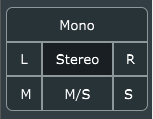

# solidUtility _V0.3.0_

**solidUtility** is a versatile channel utility plug-in for Digital Audio Workstations.
It is compatible with all DAWs that support the VST3 plug-in format.

It is currently supported on Windows 64-bit platforms, Linux 64-bit distributions, and MacOS versions starting at 10.15 on both arm and intel architectures.

This user's manual will walk you through each of the controls on the _solidUtility_ interface.

## Header

The `menu` button on the left contains:

- `tooltip` : Turn on/off the tooltips that most controls have.
- `about`   : menu option to display version, copyright, and 
              other information about the software.

## Main Controls

### Channel Mode

This set of controls allows you to configure what information is output.
This may then be further modified by the other controls.

- **Mono** : Sums the two input channels a places that sum on both outputs.
- **Stereo** : 'Normal mode' The left input is placed on the left output and the 
  right input is placed on the right output.
- **Left** : (Labelled 'L'). The **left** input is copied to both the left and the
  right outputs.
- **Right** : (Labelled 'R'). The **right** input is copied to both the left and the
  right outputs.
- **M/S** : Mid-side mode. The mid channel is place on the left output and side
  channel is placed on the right output.
- **Mid** : (Labelled 'M'). The **mid** channel is placed on both the left and right
  output channels. (Note, this functionally equivalent to Mono mode)
- **Side** : (Labelled 'S'). The **side** channel is placed on both the left and right
  output channels.

### Swap

Sends the left input to the right output and the right input to the left output.

### Invert

Switches the polarity of the input signal.

### Mute

Mute one or both outputs. Only one of the selections can be active.
Clicking on an active button will turn it off.

- **Mute** : Mute both outputs.
- **Left** : (Labelled 'L') Mute the left output.
- **Right** : (Labelled 'R' ) Mute the right output.

### DC Offset

When active, filters the incoming signal to remove any DC (0 Hz) component.

DC removal is done via a High Pass Filter with a cut-off frequency below the
audible limit. This means that it can also be used to help reduce inaudible
low-frequency "rumble" that can use up head room in the mix.

### Gain

The gain knob sets the overall gain of the output.

It can be controlled by clicking in the box and dragging up and down.
There is fine adjustment mode available if you hold Cmd/Ctrl while dragging.

You can also click in the text box and type in a specific value.

## Signal Flow

The signal flows through the controls in the following order:

- DC Offset
- Channel Mode Selector
- Swap
- Invert
- Gain
- Mute

## Appendix

### Host Automatable parameters

This table gives the names of the parameters that _solidUtility_ makes available
to the host and which control on the UI it corresponds to.

|Parameter Name|UI Control|
|---|---|
|DC Offset  | The DC Offset toggle button |
|Gain       | The Gain knob|
|InvertL    | The "Left" checkbox in the Invert group|
|InvertR    | The "Right" checkbox in the Invert group|
|Mute       | The Mute Selector button set|
|Stereo Mode| The Channel Mode Selector|
|Swap       | The Swap checkbox|
